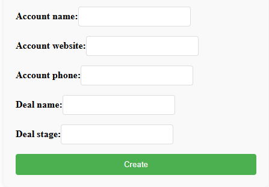
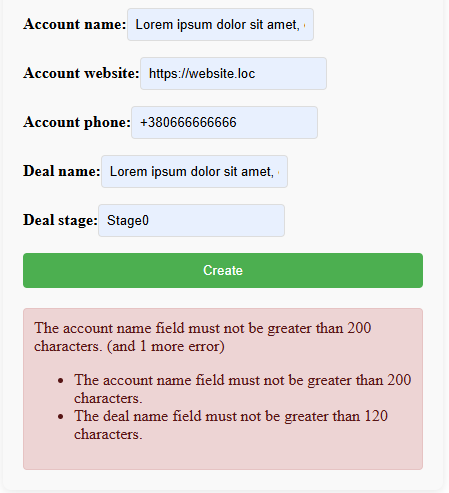

# Installation
`git clone https://github.com/lHappYzz/crmoz.git <project-dir>`

`cd <project-dir>`

`cp .env.example .env`
Get credentials from Zoho

`docker-compose up --build`

Access the form http://localhost:80

# Initial form

  

# Form with validation errors

  

# Successfully submitted form

  

